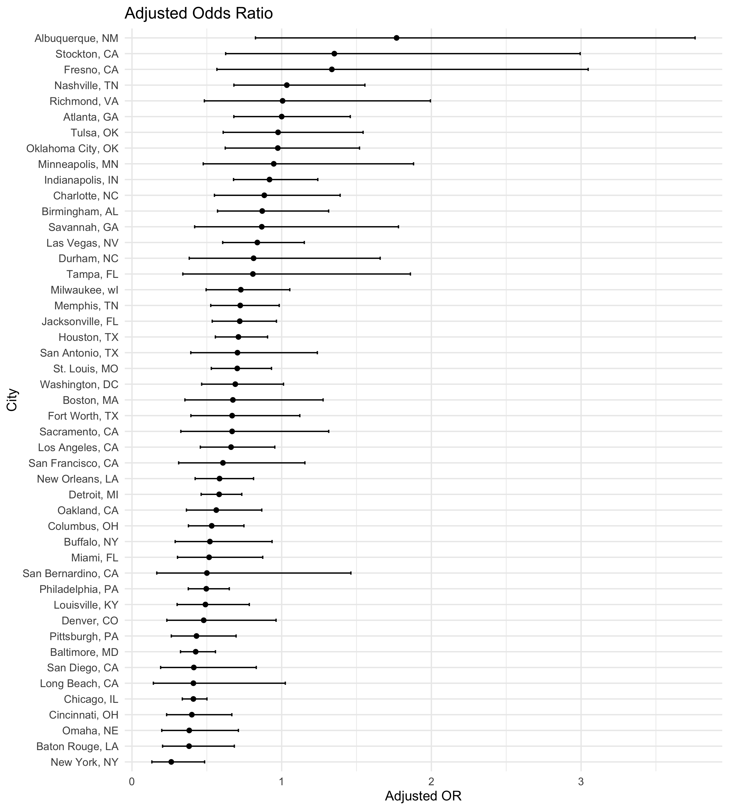
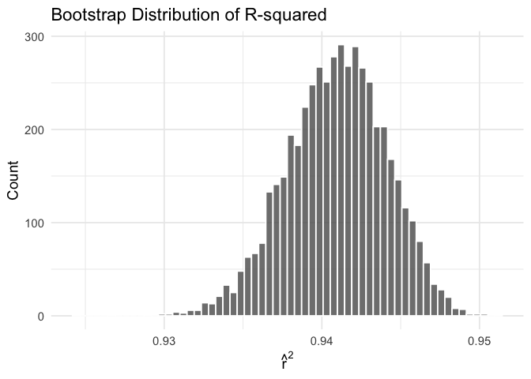
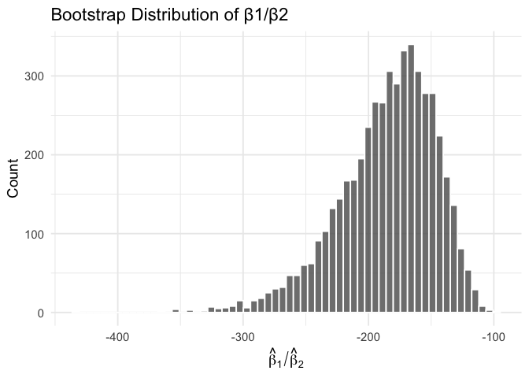
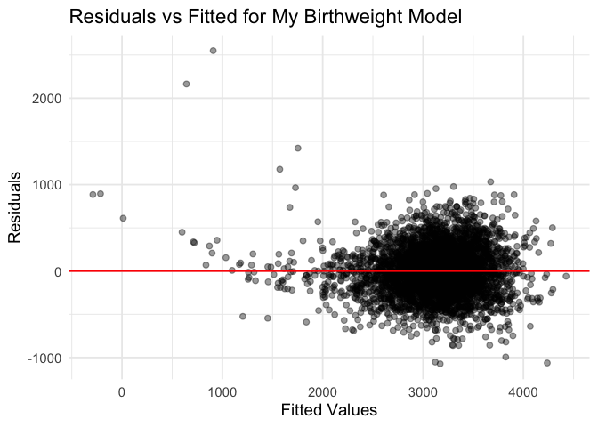
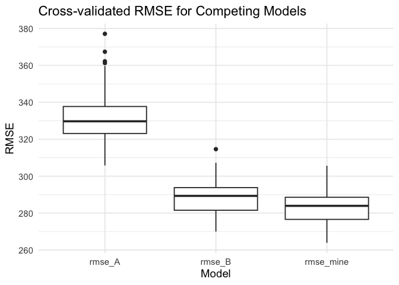

p8105_hw6_yw4664
================
Yijun Wang
2025-11-27

## Problem 1

### Loading Libraries

``` r
library(tidyverse)

library(broom)

library(purrr)
```

### 1. Data Reading & Cleaning

``` r
homicide_df = read_csv("data/homicide-data.csv") |>
  mutate(
    city_state = str_c(city, state, sep = ", "),
    solved = case_when(
      disposition == "Closed by arrest" ~ 1,
      TRUE ~ 0
    ),
    victim_age = as.numeric(victim_age)
  ) |>
  
  filter(!city_state %in% c("Dallas, TX", "Phoenix, AZ", "Kansas City, MO", "Tulsa, AL")) |>
  
  filter(victim_race %in% c("White", "Black"))
```

### 2. Logistic model for Baltimore

``` r
baltimore_df =
  homicide_df |>
  filter(city_state == "Baltimore, MD")

baltimore_fit =
  glm(
    solved ~ victim_age + victim_sex + victim_race,
    data = baltimore_df,
    family = binomial()
  )

# tidy version with OR + CI
baltimore_or =
  baltimore_fit |>
  tidy(conf.int = TRUE, exponentiate = TRUE)

# Odds Ratio
baltimore_or |> filter(term == "victim_sexMale")
```

    ## # A tibble: 1 × 7
    ##   term           estimate std.error statistic  p.value conf.low conf.high
    ##   <chr>             <dbl>     <dbl>     <dbl>    <dbl>    <dbl>     <dbl>
    ## 1 victim_sexMale    0.426     0.138     -6.18 6.26e-10    0.324     0.558

### 3. Logistic models for each city

``` r
models_df =
  homicide_df |>
  nest(data = -city_state) |>
  mutate(
    fit = map(
      data,
      ~ glm(
        solved ~ victim_age + victim_sex + victim_race,
        data = .x,
        family = binomial()
      )
    ),
    results = purrr::map(
      fit,
      ~ tidy(.x, conf.int = TRUE, exponentiate = TRUE)
    )
  ) |>
  select(city_state, results) |>
  unnest(results) |>
  filter(term == "victim_sexMale") |>
  rename(
    or = estimate,
    ci_low = conf.low,
    ci_high = conf.high
  )
```

### 4. Plot estimated ORs and CIs for each city

``` r
models_df |>
  mutate(city_state = fct_reorder(city_state, or)) |>
  ggplot(aes(x = city_state, y = or)) +
  geom_point() +
  geom_errorbar(aes(ymin = ci_low, ymax = ci_high), width = 0.2) +
  coord_flip() +
  labs(
    title = "Adjusted Odds Ratio",
    x = "City",
    y = "Adjusted OR"
  ) +
  theme_minimal(base_size = 12)
```



Across cities, the adjusted odds ratios comparing male to female victims
show considerable variability. Most cities have ORs close to 1,
indicating only modest differences in clearance rates after adjusting
for age and race.

A small number of cities exhibit notably higher or lower ORs, but many
of these estimates have wide confidence intervals, suggesting limited
data and substantial uncertainty. Cities do not follow a consistent
geographic pattern.

## Problem 2

### Loading Libraries and Data

``` r
library(tidyverse)
library(p8105.datasets)
library(broom)
library(modelr)
library(rsample)

data("weather_df")

weather_clean =
  weather_df |>
  drop_na(tmax, tmin, prcp) |>
  select(tmax, tmin, prcp)
```

### Bootstrap Function

``` r
boot_est = function(df) {
  
  fit = lm(tmax ~ tmin + prcp, data = df)
  
  r2_val = glance(fit)$r.squared
  
  coefs = tidy(fit)
  beta1 = coefs |> filter(term == "tmin") |> pull(estimate)
  beta2 = coefs |> filter(term == "prcp") |> pull(estimate)
  
  tibble(
    r2 = r2_val,
    beta_ratio = beta1 / beta2
  )
}
```

### 5000 Bootstrapping

``` r
set.seed(1)

boot_results =
  bootstraps(weather_clean, times = 5000) |> 
  mutate(
    estimates = map(splits, ~ boot_est(analysis(.x))) 
  ) |>
  unnest(estimates) |>
  select(id, r2, beta_ratio)
```

### Plot the distribution of R²

``` r
boot_results |>
  ggplot(aes(x = r2)) +
  geom_histogram(
    bins = 60,
    color = "white",
    alpha = 0.8
  ) +
  theme_minimal(base_size = 14) +
  labs(
    title = "Bootstrap Distribution of R-squared",
    x = expression(hat(r)^2),
    y = "Count"
  )
```

<!-- -->

The bootstrap distribution of R² is approximately symmetric, centered
around 0.94, and being pretty much narrow. This indicates that the
linear model explains a stable proportion of variation in tmax when
resampling the data.

### Plot the distribution of β₁/β₂

``` r
boot_results |>
  ggplot(aes(x = beta_ratio)) +
  geom_histogram(
    bins = 60,
    color = "white",
    alpha = 0.8
  ) +
  theme_minimal(base_size = 14) +
  labs(
    title = "Bootstrap Distribution of β1/β2",
    x = expression(hat(beta)[1] / hat(beta)[2]),
    y = "Count"
  )
```

<!-- -->

The distribution of the ratio β1/β2 is much wider and right-skewed.

This instability occurs because the coefficient for precipitation is
very small and close to zero, so small fluctuations in bootstrap samples
produce large changes in the ratio.

### 95% Confidence Intervals

``` r
ci_table =
  boot_results |>
  summarize(
    r2_lower  = quantile(r2, 0.025),
    r2_upper  = quantile(r2, 0.975),
    ratio_lower = quantile(beta_ratio, 0.025),
    ratio_upper = quantile(beta_ratio, 0.975)
  )

ci_table
```

    ## # A tibble: 1 × 4
    ##   r2_lower r2_upper ratio_lower ratio_upper
    ##      <dbl>    <dbl>       <dbl>       <dbl>
    ## 1    0.934    0.947       -275.       -125.

## Problem 3

### Loading Libraries and Data

``` r
library(tidyverse)
library(modelr)

birthweight_raw =
  read_csv("data/birthweight.csv")

birthweight_df =
  birthweight_raw |>
  janitor::clean_names() |>
  mutate(
    babysex = factor(babysex, labels = c("male", "female")),
    frace = factor(frace),
    mrace = factor(mrace),
    malform = factor(malform, labels = c("absent", "present"))
  ) |>
  drop_na()
```

### Propose a regression model for birthweight and show a plot of model residuals against fitted values

``` r
model =
  lm(bwt ~ bhead + blength + gaweeks + ppbmi + smoken + wtgain,
     data = birthweight_df)

birthweight_df |>
  add_predictions(model) |>
  add_residuals(model) |>
  ggplot(aes(x = pred, y = resid)) +
  geom_point(alpha = 0.4) +
  geom_hline(yintercept = 0, color = "red") +
  theme_minimal(base_size = 14) +
  labs(
    title = "Residuals vs Fitted for My Birthweight Model",
    x = "Fitted Values",
    y = "Residuals"
  )
```

<!-- -->

I selected predictors based on biological factors which are known to
influence birthweight. Fetal size variables (head circumference and
length), gestational age, and maternal health indicators (pre-pregnancy
BMI, weight gain, and smoking) were included.

The residuals vs fitted plot shows residuals centered around zero with
no strong nonlinear pattern, suggesting that the model captures the main
structure of the data pretty well.

### Compare my model to two others

``` r
model_A =
  lm(bwt ~ blength + gaweeks, data = birthweight_df)

model_B =
  lm(bwt ~ bhead * blength * babysex, data = birthweight_df)

## Cross-validation

set.seed(1)

cv_df =
  crossv_mc(birthweight_df, 100) |> 
  mutate(
    train = map(train, as_tibble),
    test  = map(test, as_tibble),

    fit_mine = map(train, ~ lm(bwt ~ bhead + blength + gaweeks + ppbmi + smoken + wtgain,
                               data = .x)),
    fit_A    = map(train, ~ lm(bwt ~ blength + gaweeks, data = .x)),
    fit_B    = map(train, ~ lm(bwt ~ bhead * blength * babysex, data = .x))
  ) |>
  mutate(
    rmse_mine = map2_dbl(fit_mine, test, ~ rmse(model = .x, data = .y)),
    rmse_A    = map2_dbl(fit_A,    test, ~ rmse(model = .x, data = .y)),
    rmse_B    = map2_dbl(fit_B,    test, ~ rmse(model = .x, data = .y))
  )

## Comparing RMSE

cv_df |>
  select(starts_with("rmse")) |>
  pivot_longer(everything(), names_to = "model", values_to = "rmse") |>
  ggplot(aes(x = model, y = rmse)) +
  geom_boxplot() +
  theme_minimal(base_size = 14) +
  labs(
    title = "Cross-validated RMSE for Competing Models",
    x = "Model",
    y = "RMSE"
  )
```

<!-- -->

My proposed model achieves the lowest and most stable RMSE, showing
better and more reliable performance.
